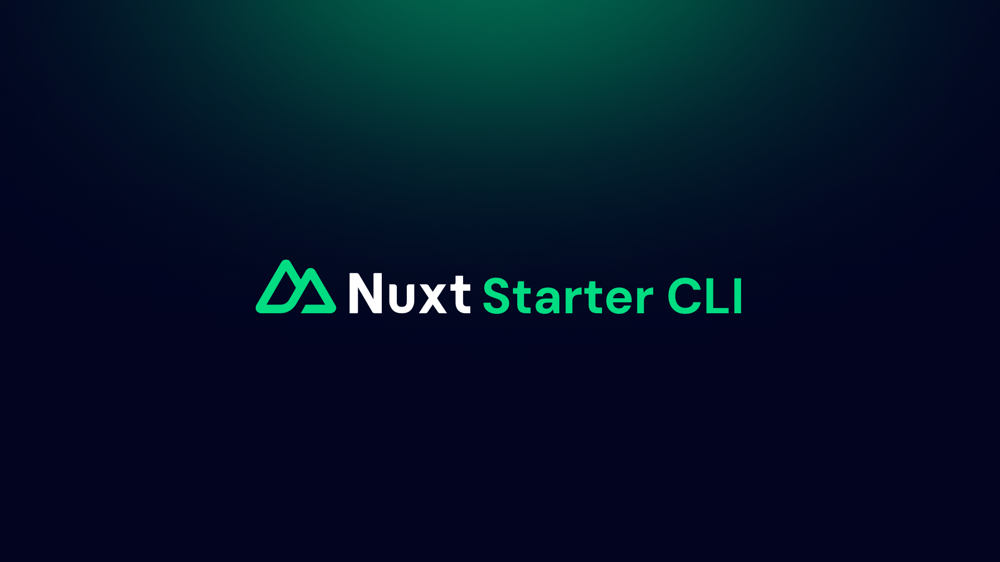

# Nuxt Starter CLI

Nuxt Starter allow you to create a project and directly add the `@nuxt` modules directly using a CLI.

With a single command, you can initialize a Nuxt project and specify which official Nuxt modules you want to include, streamlining the setup process. This tool is designed to save time and ensure consistency across projects by automating the installation and configuration of commonly used modules.

## 💻 Development

- Clone repository
- Install dependencies using `bun install`
- Build using `bun run build`
- Try using `bun src/index.ts`

## 📌 Planned feature

- Add support for popular community modules and plugins.
- Allow users to extend the CLI with custom commands.
- Support for custom project templates, so users can start with a pre-configured setup using config files